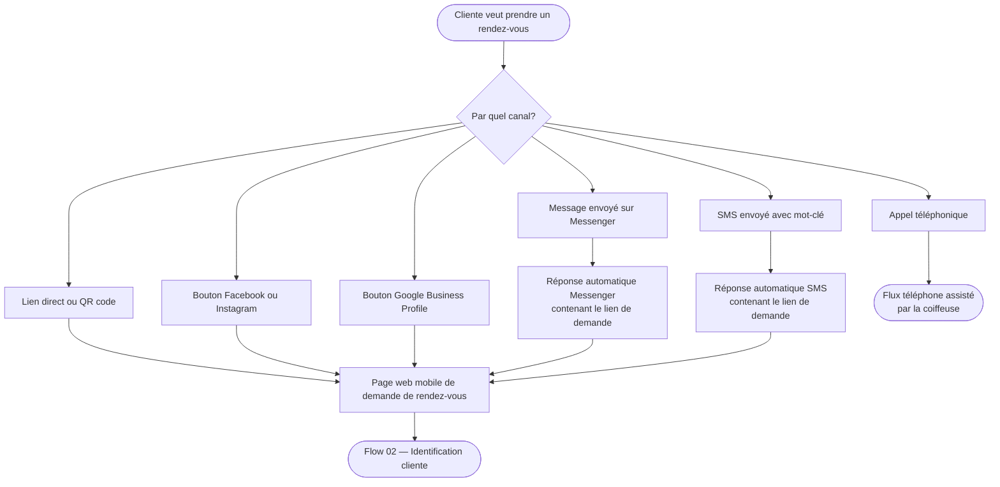

# Flow 01 — Entrée multicanal vers le flux unique

**Interface** : Cliente  
**Objectif** : Montrer que tous les canaux d'entrée convergent vers une seule page web mobile de demande de rendez-vous.

## Notes

- Tous les canaux numériques convergent vers **une seule URL**.
- Le flux téléphone est traité séparément via l'interface coiffeuse (voir [coiffeuse/06-telephone-assiste.md](../coiffeuse/06-telephone-assiste.md)).
- La source d'entrée est enregistrée pour analyse.
