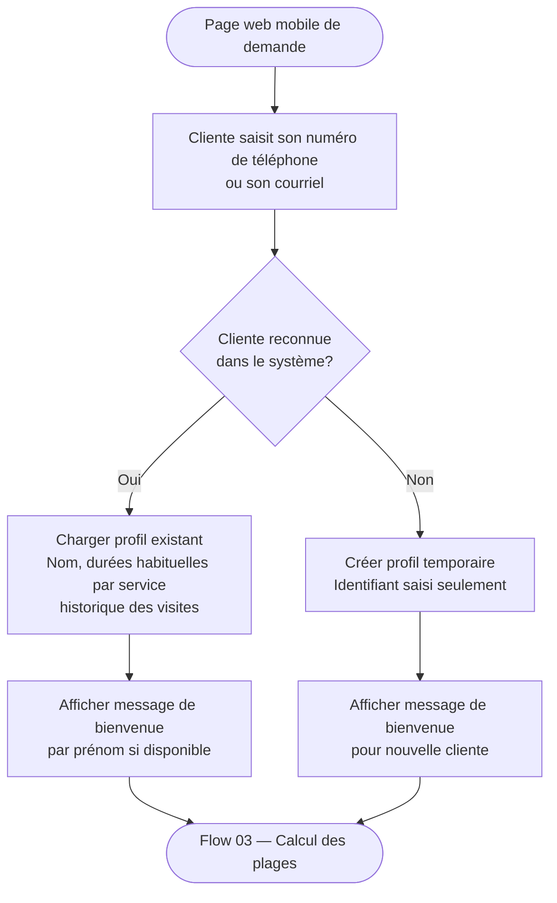

# Flow 02 — Identification cliente

**Interface** : Cliente  
**Objectif** : Reconnaître la cliente par son téléphone ou courriel afin de charger son profil et ses durées habituelles, ou créer un profil temporaire pour une nouvelle cliente.

## Notes

- L'identifiant principal est le **numéro de téléphone** (prioritaire) ou le **courriel**.
- Aucun mot de passe n'est requis au POC.
- Le profil temporaire d'une nouvelle cliente est complété automatiquement avec les durées par défaut du service choisi.
- La fiche cliente définitive est créée côté coiffeuse après le premier rendez-vous confirmé.
