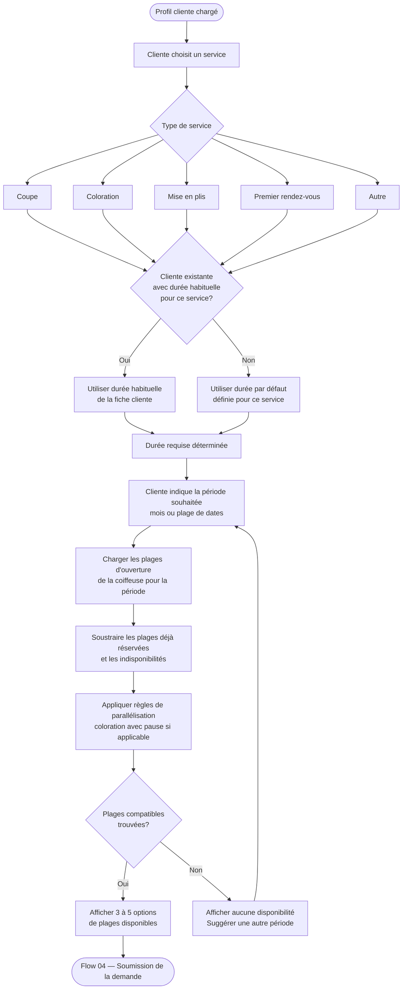

# Flow 03 — Calcul des plages compatibles

**Interface** : Cliente  
**Objectif** : Déterminer la durée requise (selon profil ou défaut), puis filtrer les plages disponibles en tenant compte de l'agenda existant et des règles de parallélisation.

## Notes

- Services de base du POC : coupe, coloration, mise en plis, premier rendez-vous, autre.
- La durée habituelle par service est stockée dans la fiche cliente (voir [coiffeuse/07-liste-clientes-durees.md](../coiffeuse/07-liste-clientes-durees.md)).
- Les règles de parallélisation (pause coloration) sont décrites dans [coiffeuse/05-coloration-parallele.md](../coiffeuse/05-coloration-parallele.md).
