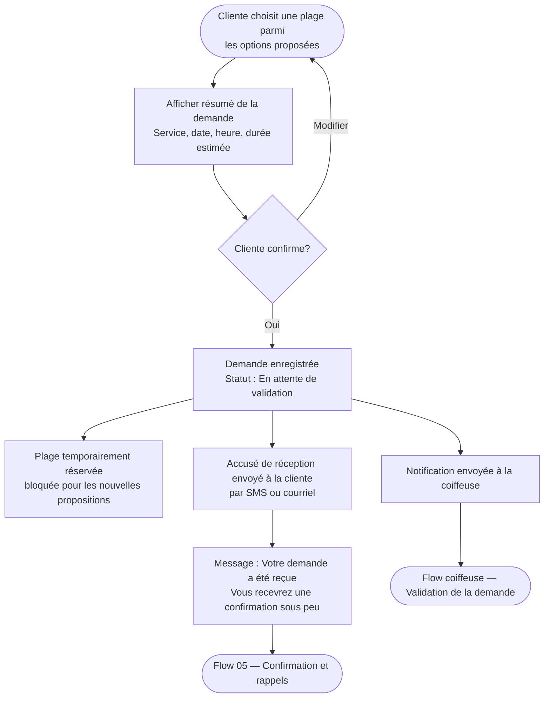

# Flow 04 — Soumission de la demande

**Interface** : Cliente
**Objectif** : Créer une demande de rendez‑vous provisoire et notifier la cliente par le canal correspondant à sa méthode d'identification.

**Mockup** : ../../C-UX-Scenarios/client/flow-04-confirmation.html

```mermaid
flowchart TD
  A([Cliente sélectionne une plage]) --> B[Créer demande (statut = pending / en_attente)]
  B --> C{Méthode d'identification}
  C -->|phone| D[Envoyer notification par texto (SMS) — « confirmation par texto »]
  C -->|email| E[Envoyer notification par courriel — « confirmation par courriel »]

  D --> NEXT([Flow 05 — Approvisionnement / Validation propriétaire])
  E --> NEXT
```

## Règles de détection (POC)

- Si l'identifiant contient un `@` → `email`.
- Sinon si l'identifiant contient des chiffres → `phone`.
- Si les deux existent (cas où plusieurs champs seraient fournis) → prioriser `phone` (envoi SMS).

## Message côté cliente

- Afficher un message intermédiaire indiquant que la plage a été réservée pour approbation et préciser le canal utilisé (« par texto » ou « par courriel »). Voir mockup Flow 04.

## Remarques

- La notification envoyée doit résumer le service, la date et l'heure demandés et indiquer que la confirmation finale arrivera après approbation.
- Le propriétaire vérifie/valide la demande via son interface (Flow coiffeuse) — la confirmation finale est ensuite envoyée par le même canal.
# Flow 04 — Soumission de la demande

**Interface** : Cliente  
**Objectif** : Permettre à la cliente de confirmer son choix de plage et soumettre sa demande, tout en recevant un accusé de réception immédiat.



## Notes

- La plage est **temporairement bloquée** dès la soumission pour éviter les doublons.
- Si la coiffeuse ne valide pas dans un délai configurable, la plage peut être libérée automatiquement.
- Le canal de notification (SMS ou courriel) est déterminé selon l'identifiant fourni à l'étape d'identification.
