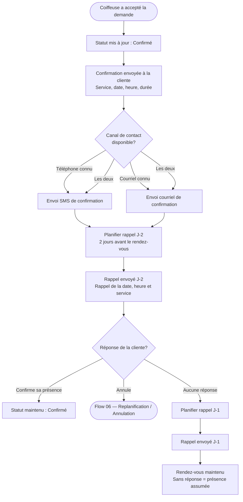

# Flow 05 — Confirmation et rappels

**Interface** : Cliente  
**Objectif** : Envoyer une confirmation claire après validation par la coiffeuse, puis déclencher les rappels automatiques avant le rendez-vous.

## Notes

- Les rappels sont automatiques et ne nécessitent aucune action de la coiffeuse.
- Si la coiffeuse **refuse** la demande plutôt que de l'accepter, la cliente reçoit un message d'invitation à choisir une autre plage (voir [coiffeuse/03-validation-demande.md](../coiffeuse/03-validation-demande.md)).
- Les rendez-vous manqués sont enregistrés pour usage futur (statistiques, frais éventuels).
