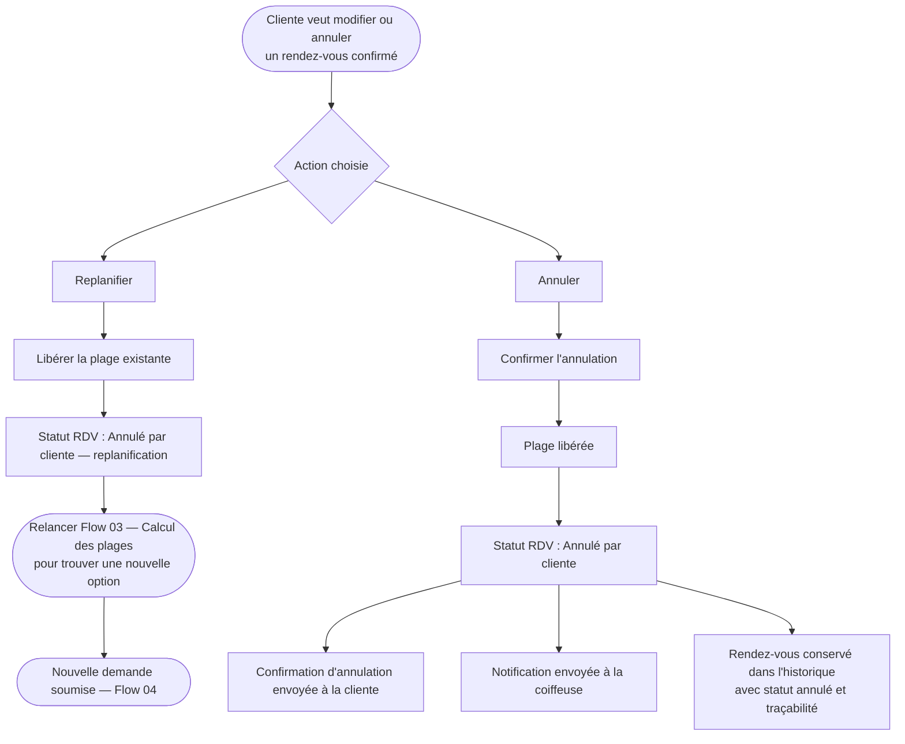

# Flow 06 — Replanification et annulation

**Interface** : Cliente  
**Objectif** : Permettre à la cliente de modifier ou annuler un rendez-vous confirmé, en libérant la plage et en maintenant la traçabilité.

## Notes

- La plage annulée est **immédiatement libérée** et redevient disponible pour d'autres demandes.
- Toutes les annulations sont conservées dans l'historique pour permettre un suivi des no-shows.
- La coiffeuse est notifiée de chaque annulation afin de gérer son agenda.
