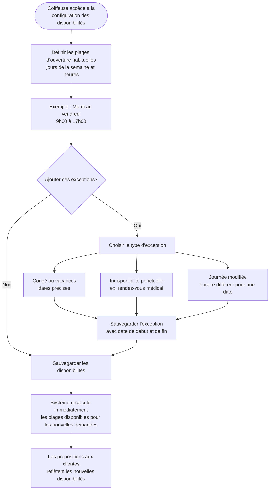

# Flow 01 — Configuration des disponibilités

**Interface** : Coiffeuse  
**Objectif** : Permettre à la coiffeuse de définir et maintenir ses plages d'ouverture habituelles ainsi que ses exceptions, afin que le moteur de propositions soit toujours à jour.

## Notes

- Les plages d'ouverture sont la **base de calcul** de toutes les propositions aux clientes.
- Une modification de disponibilité **n'affecte pas** les rendez-vous déjà confirmés.
- Les exceptions ponctuelles peuvent être ajoutées ou retirées à tout moment.
