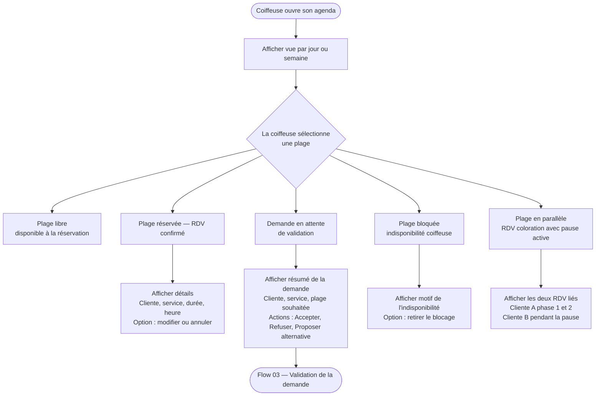

# Flow 02 — Consultation de l'agenda et des réservations

**Interface** : Coiffeuse  
**Objectif** : Permettre à la coiffeuse de visualiser rapidement son agenda et d'accéder aux détails de chaque plage.

## Notes

- La vue agenda doit être **lisible sur mobile** pour une utilisation entre deux services.
- Les demandes en attente doivent être visuellement distinctes des RDV confirmés.
- La parallélisation coloration est représentée de façon claire pour éviter les erreurs de lecture.
