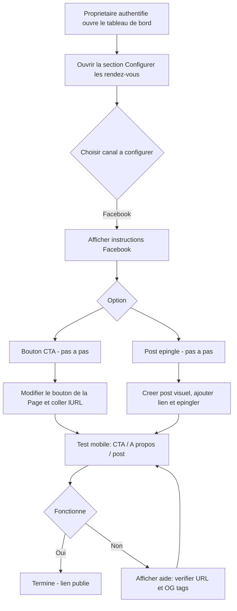

# Flow — Configuration depuis "Configurer les rendez‑vous" (redirection vers réservation)

**Interface** : Propriétaire / Coiffeuse via le tableau de bord de gestion du salon
**Objectif** : Depuis la section **"Configurer les rendez‑vous"** du tableau de bord, guider la propriétaire pour configurer la Page Facebook afin qu'elle redirige directement vers la page de réservation (Flow 02). Le module fournit les textes et actions à copier.

**Lien cible de réservation** : https://popforge.github.io/pop-salon/client/flow-02-identification.html

Note: Ces actions seront présentées directement dans l'interface "Configurer les rendez‑vous" de l'application coiffeuse une fois la propriétaire authentifiée. Le contenu ci‑dessous est une version texte de référence pour l'équipe produit et le contenu in‑app.



## Étapes détaillées (mode opératoire pour la coiffeuse)

1) Ajouter / modifier le bouton d'action (CTA)
- Ouvrez votre Page Facebook en tant qu'administrateur.
- Sous la photo de couverture, cliquez sur le bouton (ou « Ajouter un bouton »).
- Choisissez l'action la plus adaptée : **Prendre rendez‑vous** / **Réserver**. Si indisponible, choisissez `Contactez-nous` → `Visiter le site`.
- Collez l'URL cible de réservation (voir plus haut) et sauvez.

2) Mettre le lien dans les informations de la Page (À propos)
- Cliquez sur **Modifier les informations de la Page**.
- Collez l'URL dans le champ **Site web** / **Website**.
- Sauvegardez.

3) Créer et épingler un post avec le lien
- Rédigez un post simple et visuel : téléversez une image 1080×1080 (photo du salon ou cliente satisfaite).
- Texte exemple à copier :
  > Besoin d’un rendez‑vous vite fait ? ✂️ Prenez‑le en ligne en 2 minutes → https://popforge.github.io/pop-salon/client/flow-02-identification.html
  > #PauseCoiffee #RendezVous
- Publiez, puis cliquez sur les trois points du post (…) → **Épingler en haut de la Page**.

4) Tester (vital)
- Ouvrez votre Page en navigation privée ou demandez à quelqu’un qui n’est pas admin.
- Testez ces chemins : le bouton CTA, le lien dans « À propos », le lien depuis le post épinglé.
- Si tout ouvre la page de réservation, c’est bon.

5) Si le lien n'affiche pas un aperçu propre sur Facebook
- Ajoutez (ou demandez à la personne qui gère le site) des balises Open Graph sur la page cible pour un bel aperçu :

```html
<meta property="og:title" content="Pop Salon — Prendre rendez‑vous" />
<meta property="og:description" content="Prenez rendez‑vous en ligne en quelques clics — pas de compte requis." />
<meta property="og:image" content="https://popforge.github.io/pop-salon/assets/og-flow02-1200x630.png" />
<meta property="og:url" content="https://popforge.github.io/pop-salon/client/flow-02-identification.html" />
```

6) Notes et recommandations
- Préférez un visuel chaleureux (photo réelle) pour le post ; ajoutez une petite bande texte sur l'image « Prendre rendez‑vous ».
- Gardez le texte du post court et mettez le lien clairement. Facebook génère souvent un aperçu automatiquement si les OG tags sont présents.
- N’utilisez PAS un QR sur Facebook (inutile sur écran) — gardez le QR pour documents imprimés ou affiches en salon.

## Checklist rapide pour la coiffeuse
- [ ] Bouton CTA configuré et testé
- [ ] URL collée dans « À propos »
- [ ] Post visuel créé et épinglé
- [ ] Test mobile effectué (CTA / post / À propos)
- [ ] OG tags ajoutés si aperçu souhaité

---

Fichier ajouté automatiquement : `design-artifacts/B-Trigger-Map/coiffeuse/00-facebook-configuration.md`
