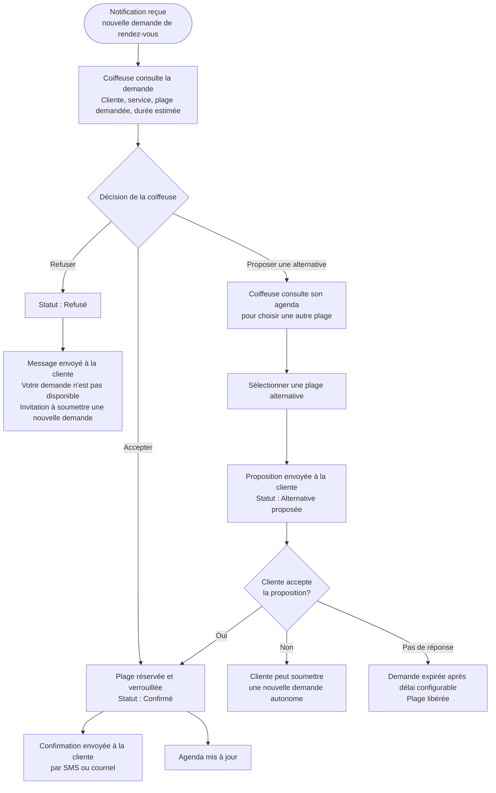

# Flow 03 — Validation d'une demande

**Interface** : Coiffeuse  
**Objectif** : Permettre à la coiffeuse d'accepter, refuser ou proposer une alternative pour chaque demande de rendez-vous reçue.

## Notes

- Le délai de réponse de la coiffeuse est à calibrer selon son usage réel (hypothèse à valider).
- Une demande non traitée après un délai configurable peut être notifiée à nouveau à la coiffeuse.
- La plage est **temporairement bloquée** dès la soumission client (voir [client/04-soumission-demande.md](../client/04-soumission-demande.md)).
