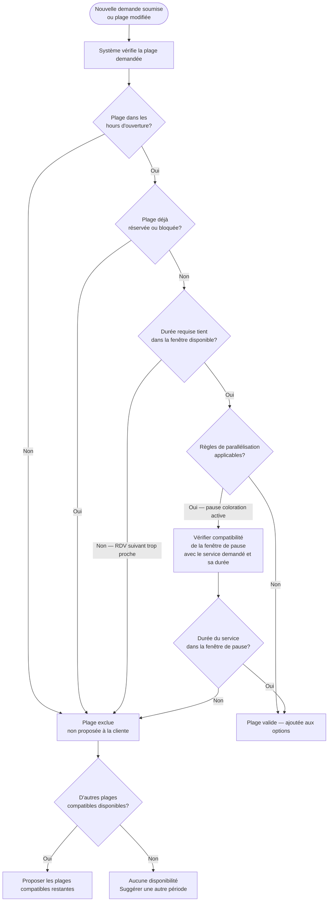

# Flow 04 — Prévention des conflits de réservation

**Interface** : Coiffeuse (moteur système)  
**Objectif** : S'assurer que le système ne propose jamais une plage incompatible et résout automatiquement les cas de conflit.

## Notes

- Ce flow est exécuté **côté système** à chaque demande ou modification de l'agenda.
- La prévention des conflits est une règle automatique, sans intervention manuelle.
- Les règles de parallélisation coloration sont détaillées dans [coiffeuse/05-coloration-parallele.md](coiffeuse/05-coloration-parallele.md).
