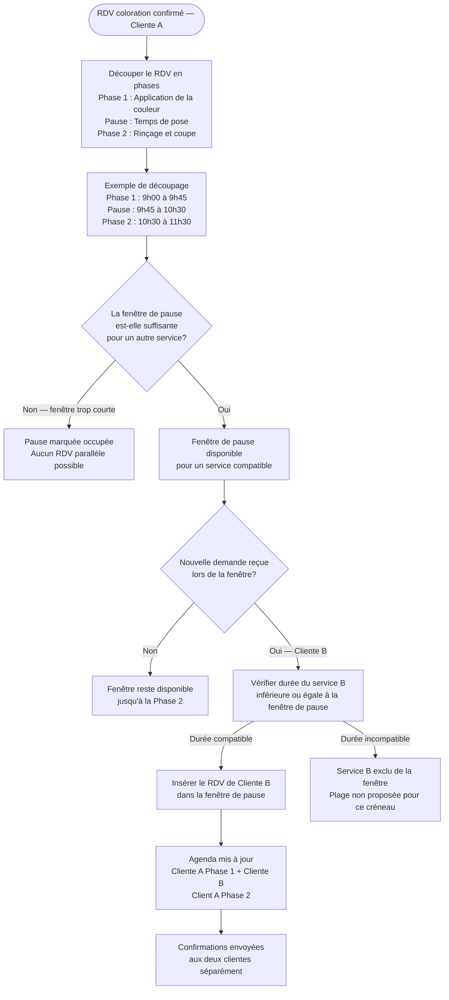

# Flow 05 — Coloration avec pause et rendez-vous en parallèle

**Interface** : Coiffeuse (moteur système + agenda)  
**Objectif** : Modéliser la réalité métier d'une coloration avec temps de pause, et permettre l'insertion d'un second rendez-vous compatible pendant cette pause.

## Notes

- Le découpage en phases est propre aux services de **coloration**. Les autres services sont traités comme un bloc continu.
- La **durée de la pause** est configurable par service et peut varier selon la technique utilisée.
- La coiffeuse peut visualiser les deux rendez-vous liés dans l'agenda (voir [coiffeuse/02-agenda-reservations.md](coiffeuse/02-agenda-reservations.md)).
- **Hypothèse à valider** : les durées réelles des phases (application, pose, rinçage) avec Pause Coiffée.
