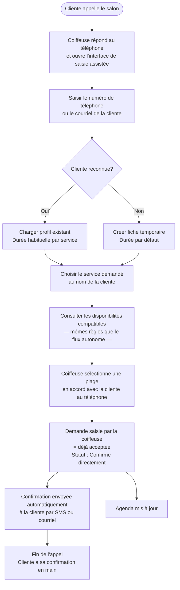

# Flow 06 — Saisie assistée par la coiffeuse (téléphone)

**Interface** : Coiffeuse  
**Objectif** : Permettre à la coiffeuse de saisir une demande de rendez-vous au nom d'une cliente qui appelle par téléphone, en passant par les mêmes règles moteur que le flux autonome.

## Notes

- Le flux téléphone utilise **les mêmes règles moteur** que le flux autonome, sans exception.
- La demande est directement confirmée (pas de passage par l'étape de validation), puisque la coiffeuse prend elle-même la décision en temps réel.
- La confirmation envoyée à la cliente sert de rappel écrit et remplace la prise de note manuelle.
- Ce flux est la solution pour la clientèle qui ne peut pas utiliser le canal numérique (environ 10 % selon le persona).
