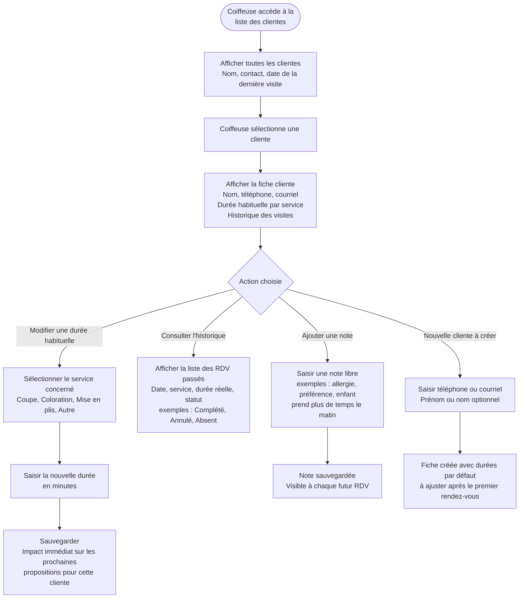

# Flow 07 — Gestion de la liste clientes et des durées habituelles

**Interface** : Coiffeuse  
**Objectif** : Permettre à la coiffeuse de consulter et mettre à jour sa liste de clientes, les durées habituelles par service, et les notes pertinentes.

## Notes

- Les durées habituelles sont **par service** et par cliente.
- La modification d'une durée prend effet immédiatement sur les nouvelles propositions.
- L'historique aide à ajuster les durées après observation réelle (ex. : après un premier RDV avec une nouvelle cliente).
- Les notes libres permettent de capturer la réalité métier sans surcharger la fiche (ex. : enfant anxieux, cheveux épais, coloration longue).
